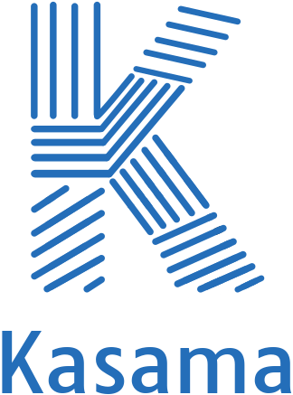

#

Improve your coding habits with Kasama! 

Track your coding sessions, test runs, VCS interactions, and many more.

 

-   :star: __Your fitness tracker for coding__

    ---

    Keep track of your coding sessions in your IntelliJ IDE

-   :material-cog: __Discover your development patterns__

    ---

    Analyze your coding habits, such as test runs, VCS interactions, refactorings, and many more

-   :bar_chart: __Stats at your fingertips__

    ---

    View the stats and charts directly in your IDE

-   :lock: __Privacy first__

    ---

    No network required - the data is only stored on your disk, that's it

